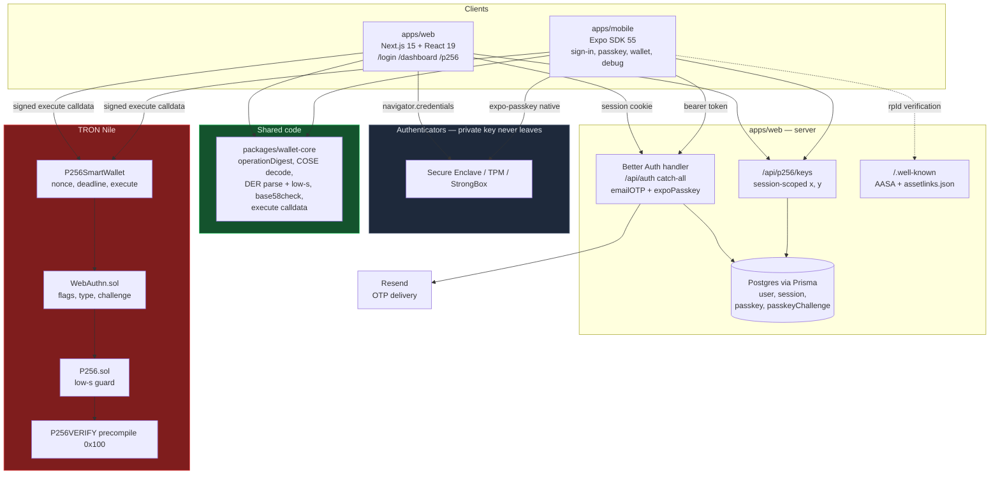

# Architecture

What the pieces are and who talks to whom. For the step-by-step ceremony,
see [end-to-end-flow.md](./end-to-end-flow.md).

## Components

| Path | Responsibility |
|---|---|
| `apps/web` | Next.js app **and** the backend for both clients. Browser WebAuthn ceremonies, the `/p256` export page, Better Auth handler, debug routes, the `.well-known` files native apps need. |
| `apps/mobile` | Expo SDK 55 client. Native ceremony via `expo-passkey`, session in `expo-secure-store`, talks to the same backend. |
| `packages/wallet-core` | Platform-free encoding shared by both clients, so `operationDigest` exists exactly once. No platform APIs — each app brings its own signing ceremony. |
| `tron_contracts` | TronBox project. `P256SmartWallet` → `WebAuthn.sol` → `P256.sol` → the `0x100` precompile, plus the digest parity test. |

## The three trust domains

This is the part worth internalising, because the boundaries are not where
people usually assume:

**1. The authenticator** holds the private key and never releases it. Both
clients only ever receive a signature. Nothing else in this diagram can
produce one.

**2. The backend** holds identity and the *public* half — the COSE key it
decodes into `x`/`y`. It authenticates users, gates the export endpoint by
session, and is where a passkey is registered. It never sees a private key.

**3. The chain** holds `x`/`y` immutably and verifies signatures itself.

The consequence: **the backend is not in the signing path for wallet
operations.** It supplies `x`/`y` once, at export time. After deployment the
client builds the digest with `wallet-core`, the authenticator signs it, and
the calldata goes straight to Nile. A compromised or offline server cannot
forge, block, or alter a wallet transaction — it can only stop you looking up
your own coordinates.

The flip side is that the chain cannot ask the server anything either. The
wallet knows one public key and nothing about accounts, which is why losing
the passkey loses the wallet regardless of the email on the account.

## Two constraints that shape the layout

- **`rpId` is the hinge between clients.** Web works on `localhost`; native
  does not, because the device verifies the rpId by fetching
  `/.well-known/apple-app-site-association` over a real certificate. That is
  the only reason the `.well-known` routes exist.
- **`wallet-core` is deliberately platform-free.** The digest that must match
  `P256SmartWallet.operationDigest` byte-for-byte lives in one file, so web
  and native cannot drift. The parity test pins it to the contract.
