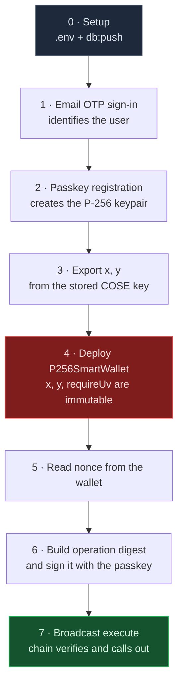
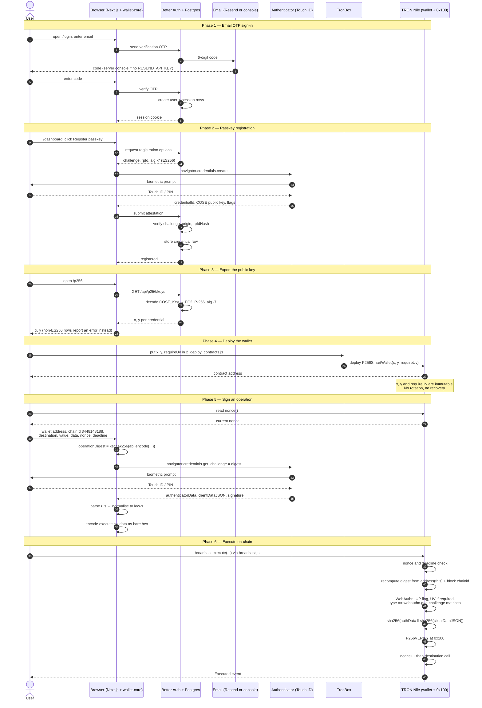

# End-to-end flow

How one passkey becomes a wallet that signs its own transactions, from an
empty database to an executed on-chain call.

Two diagrams: the phases first, then the full ceremony with every message.

## The short version



The one idea worth holding on to: **the wallet is bound to the passkey at
deploy time and never again**. Steps 1–3 produce `x` and `y`; step 4 burns
them into an immutable contract; steps 5–7 prove possession of the matching
private key on every call.

## The full ceremony



## Steps that are easy to miss

The five phases people usually list leave these out, and each one breaks the
flow silently if skipped:

| Step | Why it matters |
|---|---|
| `npm run db:push` before first sign-in | Better Auth writes to tables that do not exist yet; the OTP step fails with a database error, not an auth error. |
| **Reading `nonce()` before signing** | The digest commits to the nonce. Sign against a stale one and the signature is valid but `execute` reverts with `InvalidNonce`. |
| Choosing `requireUv` at deploy time | It is immutable. Deploying with `false` means a bare tap can move funds, and the only fix is redeploying. |
| The `deadline` | Also inside the digest. A past deadline reverts with `OperationExpired` no matter how good the signature is. |
| Low-s normalisation | The precompile rejects high-s signatures. Authenticators emit either form, so the browser folds `s` to `n - s` before encoding. |
| `RP_ID` chosen before deploying | A different rpId means a different credential, a different `x`/`y`, and a wallet that no longer matches. |

## What the passkey actually signs

Worth being explicit, because it is the one place this differs from a raw
P-256 wallet: the passkey never signs your operation digest. It signs

```
sha256(authenticatorData ‖ sha256(clientDataJSON))
```

so the operation digest travels as the **challenge** inside `clientDataJSON`.
The contract re-derives the digest itself and checks that the challenge in
the assertion matches. That is what binds a signature to one wallet, one
chain, one nonce.

The off-chain and on-chain digests agreeing is enforced by
`tron_contracts/test/operation-digest-parity.js` — see
[the contracts README](../tron_contracts/README.md#digest-parity).
